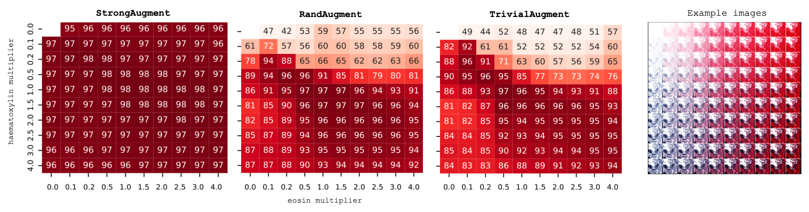
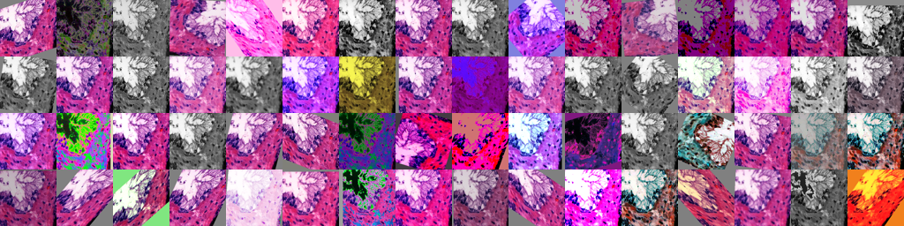

# Exposing and addressing the fragility of neural networks in digital pathology [[`arXiv`]](https://arxiv.org/abs/2206.15274)

This repository contains implementations for `StrongAugment` and creating distribution-shifted datasets for **_shifted evaluation_** of neural networks intended for clinical practice. Simply put, without strong augmentation, your neural networks will be extremely fragile to even small distribution shifts. This is beautifully shown in the figure below, where `StrongAugment` is compared to `RandAugment` and `TrivialAugment` on histological samples where the haematoxylin and eosin stains have been computationally modified. All cells have been annotated with AUROC values.



## Installation

```bash
pip3 install strong_augment
```

## Training with strong augmentation.

To train your neural networks with strong augmentatiom simply include `StrongAugment` to your image transformation pipeline!

```python
import torchvision.transforms as T
from strong_augment import StrongAugment

trnsf = T.Compose(
    T.RandomResizedCrop(224),
    T.RandomVerticalFlip(0.5),
    T.RandomHorizontalFlip(0.5),
    StrongAugment(min_ops=2, max_ops=4, p=0.4), # Just one line!
    T.ToTensor(),
    T.Normalize(mean=[0.5, 0.5, 0.5], std=[0.2, 0.2, 0.2])
    T.RandomErase(0.2)
)
```

We can also visualize the augmented images!

```python
from strong_augment import augmentation_collage, StrongAugment

augmentation_collage(img, StrongAugment())
```


## Creating shifted datasets.

Function `shift_dataset` can be used create the distribution-shifted datasets for shifted evaluation.

```python
from functools import partial
import torchvision.transforms.functional as F
from strong_augment import shift_dataset

# Let's define the distribution shift function.
shift_fn = partial(F.adjust_gamma, gamma=0.2)

# Now we can shift the dataset!
shift_dataset(
    paths=paths_to_dataset_images,
    output_dir="/data/shifted_datasets/gamma_02",
    function=shift_fn,
    num_workers=20,
)
```

    Processing images |##########| 100000/100000 [00:49<00:00]

## Citation

If you use `StrongAugment` or **_shifted evaluation_**, please cite us!

```bibtex
@paper{strong_augment2022,
    title = {Exposing and addressing the fragility of neural networks in digital pathology},
    author = {Pohjonen, Joona and Stürenberg, Carolin and Föhr, Atte and Rannikko, Antti and Mirtti, Tuomas and Pitkänen, Esa},
    url = {https://arxiv.org/abs/2206.15274},
    publisher = {arXiv},
    year = {2022},
}
```
